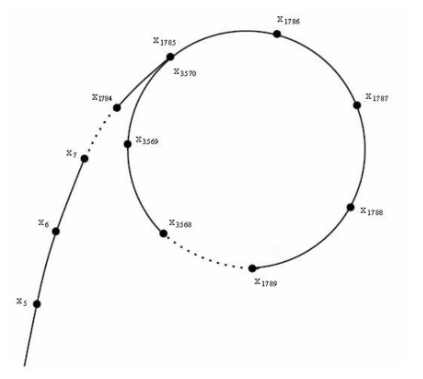

---
数论是研究整数的学问
---
# 约定

记模 $n$ 意义下的剩余系为 $\mathbb{Z}_n$，除非特别说明，否则默认 $p$ 是指质数，剩余系问题均在模质数意义下讨论。

---

# 调和级数

$$H_n \mathrel{:=} \sum_{i=1}^n \frac{1}{i}$$

被称为调和级数，容易证明，调和级数是发散的，即 $n \to \infty$ 时，有 $H_n \to \infty$，且 $H_n \sim O(\log n)$，在复杂度分析中出现调和级数时可以进行代入。

对于 $k > 1$，
$$\sum_{i=1}^n \frac{1}{i^k}$$
是收敛的。

---

# 因子个数

$n$ 的因子的个数被记为 $\sigma_0(n)$。

可以证，
$$\sum_{i=1}^n \sigma_0(i) = O(n \log n)$$
这是因为 $i$ 恰会成为 $n$ 以内的 $\left\lfloor \frac{n}{i} \right\rfloor$ 个数的因子，因此和 $\sum_{i=1}^n \frac{n}{i} = nH_n$ 即是 $O(n \log n)$ 的。

此外，单个数的因子个数也有上界 $\sigma_0(n) = O\left( n^{\frac{1}{3}} \right)$，证明较为复杂，这里略去。

---

# 欧拉函数

欧拉函数 $\varphi$ 的定义为：$\varphi(n)$ 的值为 $1, 2, \ldots, n$ 中与 $n$ 互质的数的个数。

欧拉函数有一些重要的性质。

---

# 欧拉函数的通式

设 $p_1, p_2, \dots, p_k$ 为 $n$ 的互不相同的质因子，则
$$\varphi(n) = n \prod_{i=1}^k \frac{p_i - 1}{p_i},$$
于是特别有
$$\varphi(p^k) = p^{k-1}(p-1).$$
这是因为根据容斥原理，有：

$$
\begin{aligned}
\varphi(n) &= \sum_{S \subseteq \{p_1, p_2, \dots, p_k\}} (-1)^{|S|} \frac{n}{\prod_{p \in S} p} \\
&= n \sum_{S \subseteq \{p_1, p_2, \dots, p_k\}} \prod_{p \in S} \left( -\frac{1}{p} \right) \\
&= n \prod_{i=1}^k \left( 1 - \frac{1}{p_i} \right)
\end{aligned}
$$

---

# 欧拉函数的积性

根据通式，也容易证明欧拉函数的所谓积性：若 $\gcd(a, b) = 1$，则 $\varphi(ab) = \varphi(a)\varphi(b)$。

---
---

# 快速幂
使用快速幂，能够在 $O(\log k)$ 的复杂度内计算 $a^k \bmod p$。

---
---

# 欧几里得算法
使用欧几里得算法（辗转相除法），我们能够在 $O(\log W)$ 的复杂度内计算 $a, b$ 的最大公因数 $\gcd(a, b)$。

---

# 费马小定理
若 $p$ 为素数，由费马小定理对于 $a = 1,2,\dots,p-1$，有 $a^{p-1} \equiv 1 \pmod{p}$。从而有 $a^{p-2} \equiv a^{-1} \pmod{p}$，可以利用快速幂计算乘法逆元。

---

# 欧拉定理
费马小定理的更一般的情形由欧拉定理给出：若 $\gcd(a, p) = 1$，则 $a^{\varphi(p)} \equiv 1 \pmod{p}$。

---

# 扩展欧几里得（exgcd）
使用扩展欧几里得，我们能够在 $O(\log W)$ 的复杂度内得到方程 $x_1 a + x_2 b = \gcd(a, b)$ 的一组整数解。这样的方程的解的存在性被称为**裴蜀定理**。

利用 $\text{exgcd}$，对于任意正整数 $p$ 以及满足 $\gcd(a, p) = 1$ 的 $a$，通过解方程 $x_1 a + x_2 p = 1$，可以得到 $x_1 \cdot a \equiv 1 \pmod{p}$，从而 $x_1$ 就是 $a$ 在模 $p$ 意义下的乘法逆元 $a^{-1}$。

---

# 线性求逆元
求逆元的复杂度一般是 $O(\log n)$ 的，不过，如果一次性求 $m$ 个数的逆元，可以做到 $O(\log n + m)$。

设待求逆元的数为 $a_1, a_2, \dots, a_m$，则求解步骤为：
- 求模意义下的前缀积 $A_i = \prod_{j=1}^i a_j = A_{i-1}a_i$
- 费马小定理求 $A_m^{-1}$
- 递推可知 $A_i^{-1} = A_{i+1}^{-1}a_{i+1}$
- 解得 $a_i^{-1} = A_i^{-1}A_{i-1}$
  
---

# 素数判定

假设 $n$ 不是质数，可知其必定存在一个不超过 $\sqrt{n}$ 的非平凡因子，通过枚举并检验整除性即可 $O(\sqrt{n})$ 判定质数。

还可以通过线性筛，在 $O(n)$ 的复杂度内求出 $1,2,\dots,n$ 是否为质数。

如果我们希望判断区间 $[l, r]$ 内的数是否为素数，则也可以采用由埃氏筛改进的区间筛。$[l, r]$ 以内的数如不是质数，必定存在 $\sqrt{r}$ 以内的质因子，因此先用线性筛计算 $\sqrt{r}$ 以内的质数，然后依次用这些质数筛除其在 $[l, r]$ 内的倍数（注意左右端点的计算），这样的复杂度是 $O((r-l)\log\log r + \sqrt{r})$ 的，因此常用来处理 $r \le 10^{12}, r-l \le 10^6$ 等情况。

然而，对于大数 $n$，这两种方法都不能很快判定素数。

---

# Miller-Rabin 算法
为了更快地判定大数是否为质数，考虑在质数时成立的费马小定理：$a^{n-1} \equiv 1 \pmod{n}$。如果能够找到 $a$ 使得该式不成立，则可以断定 $n$ 不是质数。

另外，考虑同余方程 $x^2 \equiv 1 \pmod{n}$，将其改写为 $(x+1)(x-1) \equiv 0 \pmod{n}$，由质数性质可知若 $n$ 为质数，则方程的解必定使得 $x+1$ 或 $x-1$ 为 $n$ 的倍数，也就有 $x \equiv 1 \pmod{n}$ 或 $x \equiv -1 \pmod{n}$ 成立。因此，如果存在一个模 $n$ 意义下既不为 $1$ 也不为 $-1$ 的数 $x$，满足 $x^2 \equiv 1 \pmod{n}$，则可断定 $n$ 不是质数。

---

于是，就有了一个利用以上两点判定一个数 $n$ 不是质数的方法：

1. 将 $n-1$ 分解为 $n-1 = u \cdot 2^t$，其中 $u$ 是一个奇数

2. 随机选定一个 $1,\dots,n-1$ 中的数 $a$

3. 利用快速幂计算 $b = a^u$

4. 接下来反复执行 $t$ 步，每次令 $b^2 \to b$，若某一次出现了 $b$ 不为 $1$ 或 $n-1$，但 $b^2$ 为 $1$ 的情况，则 $n$ 不是质数

5. 最终得到 $b = a^{n-1}$，若 $b \equiv 1 \pmod{n}$ 不成立，则 $n$ 不是质数

以上步骤 $2 - 5$ 可以反复执行，对 $n$ 进行多次判定。

---

那么我们想知道，如果经过了几次判定后 $n$ 仍然没有被认为是合数，是不是 $n$ 几乎一定是素数呢？

> **注记**  
> As a consequence, if $n$ is composite then running $k$ iterations of the Miller–Rabin test will declare $n$ probably prime with a probability at most $4^{-k}$.  
——Miller-Rabin 维基百科

由上述结论，进行若干次（例如，8 次左右）上述判定，几乎不可能有合数不被排除，于是，如果数 $n$ 经过若干次判定后仍然没有被断言为非质数，那么我们可以认为其为质数。

---

上述利用随机性判定质数的算法称为 Miller-Rabin 算法，单次复杂度仅为 $O(\log n)$，且完全可以认为是准确的。实际应用中，先对待测数判定是否被 $2,3,5,7$ 等小质数整除可以提前排除掉一些情况，往往会使算法效率更高。

---

素数检验能否以确定的方式做到呢？

>**注记**
>- if $n < 2^{64} = 18,446,744,073,709,551,616$, it is enough to test
  $a = 2, 3, 5, 7, 11, 13, 17, 19, 23, 29, 31$, and $37$.
——Miller-Rabin 维基百科

---

# 因子分解

根据至多只有一个因子超过 $\sqrt{n}$ 的性质，朴素的因子分解可以通过枚举至 $\sqrt{n}$ 并逐个试除得到 $n$ 的因子分解。

根据线性筛，还可以得到 $1,2,\dots,n$ 的每个数的最小质因子，于是经过 $O(n)$ 的预处理，我们可以高效地对 $n$ 以内的数完成因子分解。

然而，对于大数 $n$，这两种方法都不能很快进行因子分解。

---

# Pollard-rho 算法

Pollard-rho 算法可以在大约 $O(\sqrt{p})$ 的复杂度内找到 $n$ 的因子 $p$（不一定为质数）。

考虑将这一结论和素数判定算法 Miller-Rabin 进行配合，先对待分解数 $n$ 进行素数判定，若是素数则无需继续分解；否则，$n$ 必然存在不超过 $\sqrt{n}$ 的因子，于是，可以认为 Pollard-rho 的复杂度是 $O\left(n^{\frac{1}{4}}\right)$ 的。

---

Pollard-rho 基于一个被称为“生日悖论”的引理：

**引理（生日悖论）**
假定我们不断从 $0,1,2,\dots,n-1$ 中随机一个数，那么第一次随机到重复的数时，随机次数的期望为 $O(\sqrt{n})$ 级别。

证明较为复杂，这里略去。

---

基于此，我们用一种生成序列的方式：取一个函数 $f: \mathbb{Z}_n \to \mathbb{Z}_n$，以及一个随机初始值 $x_0$，生成的随机序列即为 $x_0, x_1, x_2, \dots$，满足关系 $x_{i+1} = f(x_i)$。

这样的生成序列有两个特点：
1.  如果 $f$ 的性质较好，几乎可以认为这个序列是一个不断产生随机数的序列
2.  由于序列中的每一项的值都仅仅依赖前一项，因此，如果第一次出现序列中的某个元素 $x_t$ 和之前的某个元素 $x_s$ 相等，那么之后的元素必定就是在 $x_s$ 到 $x_{t-1}$ 之间不断重复。可以形象地认为，这样一个序列形成了“$\rho$”的形状

---

**图**：一个“$\rho$”形数列的示例

---

在实践中，表现比较好的一个函数 $f$ 是 $f(x) = (x^2 + c) \bmod n$，其中 $c$ 可以随机取值，于是我们采用这种函数。

这时，假设 $n$ 的一个因子为 $p$，那么我们可以想象，
$x_0 \bmod p, x_1 \bmod p, x_2 \bmod p, \dots$ 也可以看作是一个随机生成的、$p$ 形状的序列，并且，由于生日悖论，这个序列上第一次出现重复的长度大约就在 $O(\sqrt{p})$ 左右。

那么，假设这个 $\bmod n$ 下的随机序列在发生重复之前，序列 $\bmod p$ 下的值率先发生了重复，假设重复的元素为 $x_s, x_t$（即 $x_s - x_t \equiv 0 \pmod{p}$ 但 $x_s - x_t \not\equiv 0 \pmod{n}$），那么可以断言，通过求解 $\gcd(x_s - x_t, n)$ 的值能够得到一个 $n$ 的非平凡因子。当然，对任意的 $i$，求解 $\gcd(x_{s+i} - x_{t+i}, n)$ 也可以得到非平凡因子。

---

于是，我们的任务主要为两个：

1.  在随机生成序列的 $\bmod p$ 下的值出现重复时，及时检测到，并借此求出非平凡因子
2.  在随机生成序列的 $\bmod n$ 下的值出现重复时，及时检测到，并重新设置 $c$ 和 $x_0$ 生成新的随机序列

可以发现，我们的主要问题在于高效判断是否出现了环。不过，尽管第二个问题或许可以用哈希表等解决，但第一个问题中由于 $p$ 是未知的，只能通过判断序列中是否有两个值 $x_s, x_t$ 满足 $\gcd(x_s - x_t, n)$ 是否为非平凡因子来判断是否出现了环。那么这种情形下怎么高效判断环的出现呢？

---

我们采用倍增的思想：我们设置一个哨兵 $y$ 和步长 $k$，一开始 $y = x_0, k = 1$，之后，每在随机序列中迭代 $k$ 步，我们就令 $y$ 为最新生成的 $x_i$，并将 $k$ 设为原来的两倍。我们判定是否出现环的策略也很简单：将每次迭代生成的 $x_i$ 都与 $y$ 进行对比，若 $x_i = y$（$\bmod n$ 出现环）或者 $\gcd(x_i - y, n)$ 得到了非平凡因子（$\bmod p$ 出现环）则结束生成。

可以证明，当 $y$ 进入循环圈、且迭代的步长 $k$ 超过圈的长度后，$x_i$ 和 $y$ 就会在圈长次数内相遇，真正需要迭代的次数，不超过序列有效长度（发生重复之前的长度）的 $2$ 倍，且只需要 $O(1)$ 的额外存储空间，是非常高效的。

---

通过以上算法，就可以在 $O\left(n^{\frac{1}{4}} \log n\right)$ 的时间内找到因子了。实际上，算法的瓶颈在于欧几里得算法，因此如果将每次想要和 $n$ 求解 $\gcd$ 的数暂存下来，并维护暂存的数的乘积在 $\bmod n$ 意义下的结果 $X$，累计到 $B$ 个让 $X$ 和 $n$ 做 $\gcd$。如果结果为 $1$ 则这些暂存的数就不用考虑了，否则暂存的数中一定有和 $n$ 的 $\gcd$ 为非平凡因子的，逐个判断即可。

取 $B = \log n$，则算法被优化为 $O\left(n^{\frac{1}{4}}\right)$ 的。

---

尽管 Pollard-rho 算法由于较高的效率能对 `long long` 级别的数进行因子分解，但在更大的范围内，求数的因子分解是困难的。因此，通过随机 + Miller-Rabin 质数检测得到两个较大的质数 $p, q$ 并将其相乘，比将 $pq$ 进行因子分解容易得多。这一加密解密复杂度不对称的性质引出了密码学领域著名的 RSA 非对称加密算法。

---

> 有物不知其数，三三数之剩二，五五数之剩三，七七数之剩二。问物几何？
> ——《孙子算经》

同余方程组是指这样一个问题：对于一个未知数 $x$，我们已经知道了其在模 $n_1, n_2, \dots, n_m$ 下的余数，则 $x$ 的解集为何？

用形式化的语言，即是解方程组：
$$
\begin{cases}
x \equiv a_1 \pmod{n_1} \\
x \equiv a_2 \pmod{n_2} \\
\quad \vdots \\
x \equiv a_m \pmod{n_m}
\end{cases}
$$

---

# 中国剩余定理（CRT）

中国剩余定理证明了在 $n_1, n_2, \dots, n_m$ 彼此互质的前提下，$x$ 的解集即为 $x \equiv a \pmod{n}$，其中 $a$ 是根据 $a_i, n_i$ 计算得到的，而 $n = \prod_i n_i$。
也就是说，同余方程组的解集是模 $n$ 意义下的一个同余类。

为此，我们先用中国剩余定理的方式构造出满足条件的 $a$，再证明任何模 $n$ 意义下不为 $a$ 的数都不是解，就完成了我们的证明。

---

中国剩余定理给出的 $a$ 的表达式为 $\left( \sum_{i=1}^{m} a_i \frac{n}{n_i} M_i \right) \bmod n$，其中，$M_i$ 是 $\frac{n}{n_i}$ 在模 $n_i$ 意义下的逆元，可以通过扩展欧几里得计算。

容易证明 $a_i \frac{n}{n_i} M_i \bmod n_j$ 仅在 $i = j$ 时为 $a_i$，否则为 $0$，于是这是满足要求的解。

进一步，我们设存在一个解使得 $x \equiv b \pmod{n}$，代入可知 $a - b \equiv 0 \pmod{n_i}, i = 1,2,\dots,m$，从而，$a - b$ 一定是所有 $n_i$ 的倍数，也就一定是 $n$ 的倍数，故 $a - b \equiv 0 \pmod{n}$，这样就完成了证明。

---

## 练习

维护一个长度为 $n$ 的数组 $a$，进行 $m$ 次操作，支持区间乘、单点除（保证可以整除），并求区间和在模 $p$ 意义下的结果。其中 $p$ 是一个固定值，不保证 $p$ 为质数。

约束条件：
$n, m \le 10^5$

---

## 解析

直接做比较麻烦，考虑将 $p$ 质因数分解，每次做在模 $p^k$ 意义下的结果，最后利用中国剩余定理合并。那么每个数可以分解成 $a \times p^b$，其中 $a$ 和 $p$ 互质。那么对每个数只需要记录 $a$、$b$、$a \times p^b$ 以及对应的区间和来建立线段树，就可以完成题目的任务。复杂度 $O(n \log^2 n)$。

中国剩余定理常用来处理这样的情形：希望计算一个答案模 $n$ 的结果，但由于 $n$ 不是质数遇到了困难。此时，若求解答案模 $p^k$ 的结果是方便的，则可以使用中国剩余定理。

---

## 练习

给定一张 $n$ 个点，$m$ 条边的简单无向图 $G$，求其生成树个数。

$n \le 50, m \le \dfrac{n(n-1)}{2}$

---

## 解析

由矩阵树定理，只需要计算度数矩阵减去邻接矩阵的行列式。但本题的答案并不对某个质数取模，也即需要高精度输出。

粗略地通过完全展开式估计，可以计算出答案的上界，例如，$10^{200}$。考虑到答案必定是整数，我们可以采用中国剩余定理：

取 $10^9$ 级别的 $m=30$ 个左右的质数 $p_i$，在模 $p_i$ 的意义下求矩阵的行列式，可以得到若干答案。通过中国剩余定理可以计算出答案对 $\prod p_i$ 取模以后的结果，由于答案小于 $\prod p_i$，因此取模的结果即是真正的答案。

---

唯一的问题是如何计算中国剩余定理给出的式子
$$\left( \sum_{i=1}^{m} a_i \frac{n}{n_i} M_i \right) \bmod n$$
对于每一项 $a_i \frac{n}{n_i} M_i$，可以先 $O(m)$ 计算 $\frac{n}{n_i} \bmod n_i$，再求其逆元得到 $M_i$；由于结果对 $n$ 取模，再计算出 $b_i = a_i M_i \bmod n_i$，此时利用逐个相乘，通过高精度 * 单精度计算 $b_i \frac{n}{n_i}$，必定不超过 $n$。接下来将这些数逐个高精度相加，加法取模只要在相加后判定是否超过 $n$，超过则减去就可以了。

---

# 扩展中国剩余定理（exCRT）

中国剩余定理只能解决 $n_i$ 两两互质的情形，有一定局限性。对于不保证 $n_i$ 互质的情形，可以采用扩展中国剩余定理。

扩展中国剩余定理的策略是每次考虑两个方程：
$$
\begin{cases}
x \equiv a_1 \pmod{n_1} \\
x \equiv a_2 \pmod{n_2}
\end{cases}
$$
求出其解集 $x \equiv a \pmod{\text{lcm}(n_1, n_2)}$，这个解集又可以作为一个方程继续参与合并，所以只需要考虑怎么求解两个方程。

---

根据这两个方程，$x$ 可以表示为 $a_1 + k_1 n_1$ 或 $a_2 + k_2 n_2$ 的形式，于是可以建立方程 $a_1 + k_1 n_1 = a_2 + k_2 n_2$，改写为 $k_1 n_1 - k_2 n_2 = a_2 - a_1$，这就是一个以 $k_1, k_2$ 为未知数的扩展欧几里得形式的方程。

根据 exgcd，如果 $a_2 - a_1$ 不是 $\gcd(n_1, n_2)$ 的倍数，则方程无解。否则，根据扩展欧几里得可以得到 $k_1, k_2$，也就完成了方程的合并。

由于扩展欧几里得解决思路更为快捷，因此当 $\prod n_i$ 的值为单精度时，也可以使用其代替中国剩余定理。

---

# 离散对数
离散对数是指这样一个问题：求解方程 $a^x \equiv b \pmod{p}$，其中未知数为 $x$。根据欧拉定理，可知若存在解，则必定有 $p$ 以内的解。不过即使如此，$x$ 的解往往有多个，一般需要解得最小的一个。

---

## 大步小步算法（BSGS）

大步小步算法可以在 $O(\sqrt{p})$ 的复杂度求出离散对数的最小自然数解，或说明无解。

取 $B = \lfloor \sqrt{p} \rfloor$，首先预处理出 $a^0, a^1, a^2, \dots, a^{B-1}$ 存入哈希表中，再通过计算 $a^{(-B)}$，依次取 $(a^0)^{-1}, (a^B)^{-1}, (a^{2B})^{-1}, \dots$，每当取 $(a^{kB})^{-1}$，可知要想满足 $a^{kB+j} \equiv b \pmod{p}$，必定有 $a^j \equiv b \cdot (a^{kB})^{-1} \pmod{p}$，在哈希表中查找是否有相应值即可确定答案。

可以看出，大步小步算法其实就是 meet in the middle 的一个实现。

---

# 原根
质数 $p$ 的原根是指这样一类数 $g$：$g^0, g^1, g^2, \dots, g^{p-2}$ 共 $p-1$ 个数在模 $p$ 意义下互不相同。原根并不显然是存在的，为此我们需要原根存在定理（弱化版）：质数必定有原根。

证明比较复杂，略去。

在原根 $g$ 存在的前提下，我们知道 $g^0, g^1, g^2, \dots, g^{p-2}$ 能够遍历 $1,2,\dots,p-1$ 中的所有数。

而如果 $k$ 和 $p-1$ 互质，显然在模 $p-1$ 意义下，$0, k, 2k, \dots, (p-2)k$ 能够遍历 $0,1,2,\dots,p-2$，从而在模 $p$ 意义下，$g^0, g^k, g^{2k}, \dots, g^{(p-2)k}$ 也能够遍历 $1,2,\dots,p-1$ 中的所有数。于是，$g^k$ 也是 $p$ 的原根。可以看出，$p$ 恰好有 $\varphi(p-1)$ 个原根。因此，素数的原根的数量还是较多的。

---

那么，要如何找到某个质数 $p$ 的原根呢？

一种想法是直接使用定义，可以 $O(p)$ 判断一个数 $x$ 是否是 $p$ 的原根。如果每次随机选择一个 $x$ 来判断，容易发现期望上需要判断 $\frac{p-1}{\varphi(p-1)}$ 次。

通过对 $\varphi(n)$ 的分析，可以证明 $\frac{n}{\varphi(n)}$ 的数量级为 $O(\log\log n)$。因此，上述方法的复杂度为 $O(p\log\log p)$。

事实上，许多质数都存在个位数的原根，例如 $998244353$ 有原根 $3$，$10^9+7$ 有原根 $5$。对于这些常见的质数，我们可以直接记住它们的原根。

---

如果希望对于更大的质数求原根，则需要下面这条引理，证明作为课堂练习：

>**引理**
>$g$ 是 $p$ 的原根，当且仅当对于所有 $p-1$ 的质因子 $p_1,p_2,\dots,p_k$，有
$$g^{\frac{p-1}{p_i}} \not\equiv 1 \pmod{p}$$

于是，对于大质数 $p$，可以先对 $p-1$ 进行因子分解，随后用快速幂验证随机的 $x$ 是否为原根，这样的总复杂度为 $O(\sqrt{p})$。如果使用 Pollard-rho 进行因子分解，还可以进一步优化为 $O\left(p^{\frac{1}{4}}\right)$。

---

由于 $g^0,g^1,g^2,\dots,g^{p-2}$ 互不相同，故这提供了一种从 $\{1,2,\dots,p-1\}$ 到 $0,1,\dots,p-2$ 的映射 $f: g^k \mapsto k$，且满足
$$f(ab \bmod p) \equiv f(a) + f(b) \pmod{p-1}$$
提供了类似于对数函数的性质。

---

## 练习

给定 $n,a,p$，判定是否存在 $x$ 满足 $x^n \equiv a \pmod{p}$，满足则给出一个解。
$a < p \le 10^{12}, x \le 10^{12}$

---

首先求出原根 $g$，再用 BSGS 算法，求出 $k$ 满足 $a \equiv g^k \pmod{p}$。接下来，通过求解扩展欧几里得方程 $x_1 n + x_2 p = k$，求是否有满足 $nx \equiv k \pmod{p}$ 的 $x$，如有则 $g^x$ 即为答案。否则，容易证明解不存在。

本题又被称为 $n$ 次剩余问题，在 $n=2$ 时存在更加高效的算法，称为二次剩余，大家可以自行了解。

---

# 卢卡斯定理

卢卡斯定理用于解决求解组合数 $\binom{n}{m} = \frac{n!}{m!(n-m)!}$ 在模 $p$ 意义下的值的问题。组合数的特点在于根据阶乘公式取模后计算，可能出现分子分母均为 $0$ 的情形。

卢卡斯定理的内容是：
$$\binom{n}{m} \equiv \binom{\left\lfloor \frac{n}{p} \right\rfloor}{\left\lfloor \frac{m}{p} \right\rfloor} \binom{n \bmod p}{m \bmod p} \pmod{p}$$
（我们一般认为 $n < m$ 时有 $\binom{n}{m} = 0$，定理的证明省略），其中前一半可以用卢卡斯定理继续展开，后一半可以通过预处理阶乘直接计算。复杂度为 $O(p + \log_p n)$。因此，应用卢卡斯定理时 $p$ 不能太大。

---

## 扩展卢卡斯定理

扩展卢卡斯定理用于解决 $p$ 不是质数时的情形。扩展卢卡斯依赖中国剩余定理，于是现在的问题为求解 $\binom{n}{m} \bmod p^k$。

采取将 $p$ 因子部分和非 $p$ 因子部分分开讨论的方法。对于 $p$ 因子部分，设 $f(n)$ 为 $n!$ 中所含的 $p$ 的因子个数，则有
$$f(n) = \left\lfloor \frac{n}{p} \right\rfloor + f\left(\left\lfloor \frac{n}{p} \right\rfloor\right)$$
可以以此进行 $O(\log_p n)$ 的计算，对分子分母结果相减即可得到 $p$ 因子的次数。

---

对于非 $p$ 因子，预先计算 $0!,1!,\dots,(p^k-1)!$ 中非 $p$ 因子的部分在模 $p^k$ 意义下的结果。对于更大的 $n$，设 $n!$ 中所含的非 $p$ 因子的部分模 $p^k$ 后为 $g(n)$，则有
$$g(n) = g(p^k-1)^{\left\lfloor \frac{n}{p^k} \right\rfloor} g(n \bmod p^k)$$
由于此部分必定与 $p^k$ 互质，因此逆元可以直接计算。

综合两部分即得 $\binom{n}{m} \bmod p^k$，复杂度是 $O(p^k + \log_p n)$ 的。

---

# 杂题

---

## 练习
$n$ 个小朋友在玩传球游戏，一开始球在 1 号小朋友手中，每一次传球时，手中有球的小朋友会将球传给任意一位其他小朋友（不能传给自己）。

Alice 想知道一共有多少种方法能够在 $t$ 次传球后将球传回到 1 号小朋友手中。现在，她已经知道了答案对 $998244353$ 取模后的结果是 $x$，但是她把 $t$ 的值忘掉了。

于是 Alice 想知道，满足答案对 $998244353$ 取模后的结果是 $x$ 的最小的 $t$ 是多少，如果没有这样的 $t$，输出 $-1$。一共有 $T$ 组数据。

$T \le 100, 2 \le n \le 10^6, 0 \le x < 998244353$

---

## 解析
首先考虑已知 $n,t$，怎么求出 $x$。使用动态规划，$f_{k,0}$ 表示经过 $k$ 次传球后球回到 1 号小朋友手中的方案数，$f_{k,1}$ 表示经过 $k$ 次传球后球没有回到 1 号小朋友手中的方案数，转移容易得到：

$$
\begin{bmatrix} f_{k+1,0} \\ f_{k+1,1} \end{bmatrix} = \begin{bmatrix} 0 & 1 \\ n-1 & n-2 \end{bmatrix} \begin{bmatrix} f_{k,0} \\ f_{k,1} \end{bmatrix}
$$

使用矩阵快速幂进行优化，那么 $x$ 就是 $\begin{bmatrix} 0 & 1 \\ n-1 & n-2 \end{bmatrix}^t$ 的左上角的值。

---

需要进一步分析 $\begin{bmatrix} 0 & 1 \\ n-1 & n-2 \end{bmatrix}^t$ 的各个位置的结果。可以对矩阵做一些转化：

$$
\begin{align*}
\begin{bmatrix} 0 & 1 \\ n-1 & n-2 \end{bmatrix}^t &= \left( \begin{bmatrix} 0 & 1 \\ 0 & -1 \end{bmatrix} + (n-1) \begin{bmatrix} 0 & 0 \\ 1 & 1 \end{bmatrix} \right)^t \\
&= \dots \\
&= \frac{1}{n} \begin{bmatrix} (-1)^t(n-1) + (n-1)^t & (-1)^{t+1} + (n-1)^t \\ (-1)^{t+1}(n-1) + (n-1)^{t+1} & (-1)^t + (n-1)^{t+1} \end{bmatrix}
\end{align*}
$$

---

综上，
$$
x = \frac{(-1)^t(n-1) + (n-1)^t}{n}
$$
现在想要求出最小的满足方程的 $t$，容易想到 BSGS，但是 $-1$ 和 $n-1$ 都需要幂次，无法直接运用。

通过观察发现 $-1$ 的幂比较特殊：当 $t$ 是偶数时，$(-1)^t$ 是 $1$，否则 $(-1)^t$ 是 $-1$。因此首先对 $t$ 的奇偶性分类讨论，就只需要关心 $n-1$ 的幂次的值，此时就可以使用一般的 BSGS 了。

时间复杂度 $O\left(T\sqrt{MOD}\right)$。

---

## 练习
求出前 $n$ 个正整数中，不能被前 $k$ 个质数整除的数的个数，多组数据。

$T \le 10^5,\ n \le 10^{18},\ k \le 16$

---

## 解析
首先考虑一个简单的暴力：令 $f(n,k)$ 代表答案，我们考虑在 $f(n,k-1)$ 中减去能被 $p_k$ 整除的数的个数，那就是 $f\left(\left\lfloor \frac{n}{p_k} \right\rfloor, k-1\right)$（向下取整），于是有：

$$
f(n,k) = f(n,k-1) - f\left( \left\lfloor \frac{n}{p_k} \right\rfloor, k-1 \right)
$$

可以在 $O(2^k)$ 解决一个问题，但还是不够快。

---

换一个角度考虑问题：利用简单容斥原理，我们可以枚举前 $k$ 个质数的子集，设目前的子集大小为 $j$，且所有数的乘积为 $M$，那么这个子集的贡献就是 $(-1)^j \left\lfloor \frac{n}{M} \right\rfloor$（能被这个子集的数整除的数的个数），贡献和就是答案。

考虑直接这样计算仍然是 $O(2^k)$ 的，但是，$\left\lfloor \frac{n}{M} \right\rfloor$ 可以写作 $\frac{n - n \bmod M}{M}$，于是假设前 $k$ 个质数的乘积是 $M$，那么对于所有模 $M$ 同余的 $n$，它们的答案是关于 $\left\lfloor \frac{n}{M} \right\rfloor$ 的线性函数。

当 $k=8$ 时，$M$ 的数量级是 $10^7$，暴力处理出 $n \le 2 \cdot 10^7$ 时的答案，剩下的可以通过线性关系直接推出。于是仍然利用第一种方法递归计算，只是当递归到 $k=8$ 时直接计算答案。这样，单次的复杂度就是 $O\left(2^{\frac{k}{2}}\right)$。

---

## 练习
给定一个长度为 $n$ 的序列 $a_1,a_2,\dots,a_n$，进行 $m$ 次操作。有两类操作：区间乘 $x$、区间查询 $\sum_{k=l}^r \varphi(a_i)$。

$n, m \le 10^5,\ a_i, x \le 100$

注：令 $p_1,p_2,\dots,p_k$ 为 $n$ 的所有不同质因子，则
$$
\varphi(n) = n \prod_{i=1}^k \frac{p_i-1}{p_i}
$$

---

## 解析
序列中的数总是由 100 以内的质数相乘构成，于是可以考虑用质因数分解求 $\varphi$。

考虑欧拉函数的性质：$\varphi(p^k) = (p-1)p^{k-1}$，于是，当 $a_i$ 乘以质数 $p$ 时：
- 若 $a_i$ 原本没有因子 $p$，则 $\varphi(a_i)$ 将乘以 $p-1$；
- 若 $a_i$ 原本已有因子 $p$，则 $\varphi(a_i)$ 将乘以 $p$。

而 $a_i$ 乘以 $p$ 后，就有了因子 $p$，后续再乘 $p$ 时无需特殊对待。
100 以内的质数只有 25 个，因此需要特殊处理的总次数是 $O(n)$ 的。

在区间乘 $x$ 时，我们可以先分解 $x$，将操作拆分为多次「区间乘质数 $p$」；对于区间乘 $p$ 的情况：
1.  先对维护 $\varphi$ 值的线段树执行**区间乘 $p$**的操作；
2.  利用 `set` 维护尚未含有因子 $p$ 的位置，遍历区间内这些位置，将对应位置的 $\varphi$ 值再乘以 $\frac{p-1}{p}$，然后将该位置从对应质数的 `set` 中删除。

该算法的时间复杂度为 $O(n \log n)$。

---

## 预习
### 组合数学
- 组合数和其基本性质：https://oi-wiki.org/math/combinatorics/combination/
- 容斥原理以及其简单应用：https://baike.baidu.com/item/%E5%AE%B9%E6%96%A5%E5%8E%9F%E7%90%86
  
---

